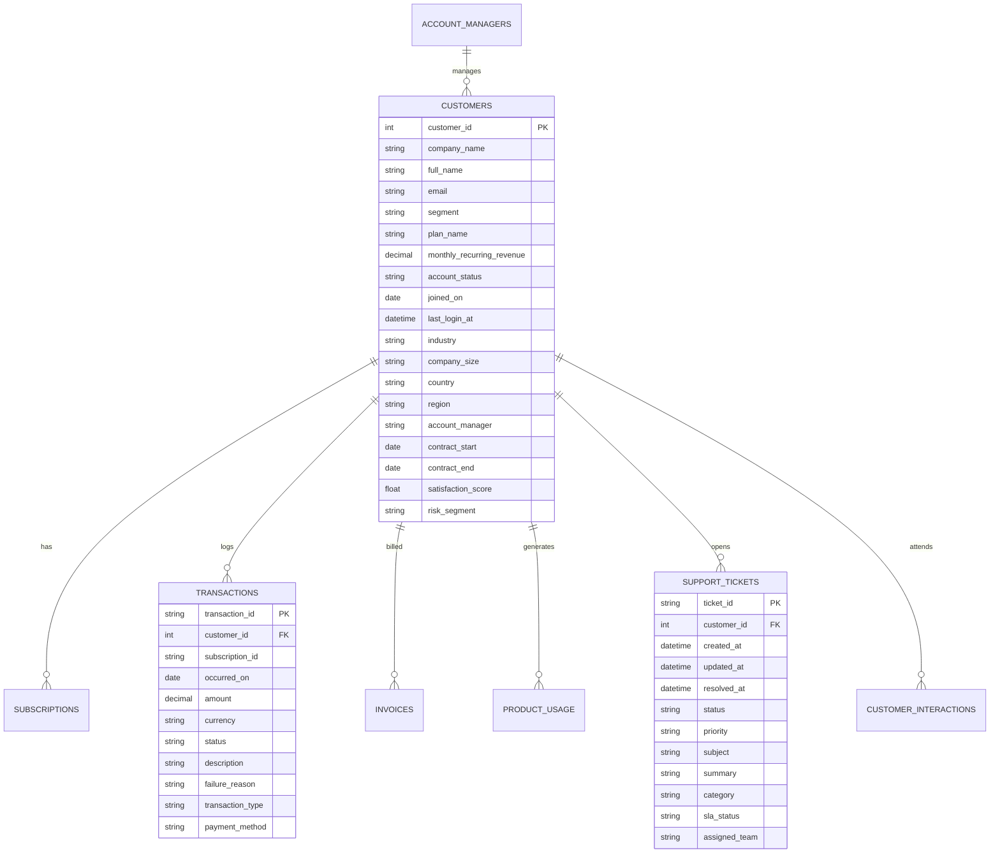

# NovaDesk Synthetic Enterprise Data Environment

## 1. Executive Summary & Business Domain

The **NovaDesk Synthetic Enterprise Data Environment** provides a deterministic, relational B2B SaaS operations database designed for autonomous multi-agent investigations, customer operations auditing, revenue recovery, and churn-risk triage.

* **Fictional Company:** **NovaDesk**
* **Business Model:** B2B customer support & workflow automation SaaS
* **Customer Tiers:**
  * **Starter** ($99/mo or $79/yr equivalent — 5 seats, 1,000 automated workflow runs)
  * **Professional** ($499/mo or $399/yr equivalent — 20 seats, 10,000 automated workflow runs)
  * **Growth** ($1,200/mo — 50 seats, 50,000 automated workflow runs)
  * **Enterprise** ($4,800/mo to $5,200/mo — 100+ seats, custom SLA & SAML SSO)

---

## 2. Dataset Scale & Volume

| Entity | Record Count | Description |
| :--- | :---: | :--- |
| **Customers** | **10,000** | Distributed across 10 global industries, 5 company sizes, and 8 geographic regions |
| **Subscriptions** | **10,000** | Active & historical subscription lifecycle records with seat counts and renewal terms |
| **Transactions** | **152,697** | 12–24 months of billing history (succeeded renewals, failed cards, refunds, credits) |
| **Invoices** | **102,077** | B2B invoices with issue dates, due dates, payment timestamps, and overdue tracking |
| **Product Usage** | **150,910** | Time-series metrics: active users, sessions, API calls, workflows, and automation runs |
| **Support Tickets** | **32,537** | Multi-department tickets (Billing, Technical, Integration, Security, SLA breaches) |
| **Interactions** | **75,385** | Logged touchpoints (executive meetings, calls, CSM check-ins, sentiment tags) |
| **Knowledge Base** | **35** | Internal policy documents (retention, SLA, dunning, refund authorization, SSO guides) |
| **Account Managers**| **50** | Dedicated Customer Success Managers and Solutions Architects |
| **Benchmark Scenarios** | **33** | Deliberately designed customer investigation scenarios with known ground truth |

---

## 3. Relational Schema & Entity Relationships

The data layer is persisted in an optimized SQLite database (`src/operations_agent/data/enterprise.db`) with Write-Ahead Logging (`WAL`) mode and indexes on foreign keys, dates, and status fields.



---

## 4. Benchmark Investigation Scenarios

The environment includes **33 deliberately designed customer scenarios** capturing real-world B2B operational dynamics:

### Highlighted Scenarios

1. **Customer 104 (`Northstar Analytics`) — Flagship Multi-Factor Churn Risk:**
   * **Behavior:** Past due status, failed Growth Annual renewal ($1,200), partial service credit refund, open high-priority reporting delay ticket `SUP-4821`.
   * **Expected Outcome:** High churn risk; triggers Human Approval Gateway for retention outreach.

2. **Customer 105 (`Harbor Retail Group`) — Healthy Growth Baseline:**
   * **Behavior:** 100% on-time subscription renewals, active seats, zero open support tickets, high satisfaction (9.4/10).
   * **Expected Outcome:** No risk; supervisor recommends standard monitoring.

3. **Customer 106 (`Cedar Health Partners`) — Enterprise Contract Escalation:**
   * **Behavior:** High MRR ($4,800), enterprise tier, approaching contract renewal in 45 days.
   * **Expected Outcome:** Executive sponsor review and renewal alignment.

4. **Customer 201 (`Alpine Logistics`) — False Churn Signal (Seasonal):**
   * **Behavior:** 40% usage drop during July/August matches identical historical seasonal decline in prior year.
   * **Expected Outcome:** False positive; recognizes seasonality and avoids unnecessary discounts.

5. **Customer 202 (`Apex Digital`) — Payment Risk Isolated from Product Satisfaction:**
   * **Behavior:** Expired corporate credit card causing payment failure despite strong 40% usage growth and high NPS (9/10).
   * **Expected Outcome:** Dunning card update workflow rather than product dissatisfaction triage.

6. **Customer 207 (`OmniCorp Solutions`) — Revenue Contraction / Failed Expansion:**
   * **Behavior:** Revenue dropped from cancelled custom workflow add-on followed by failed renewal charge.
   * **Expected Outcome:** High churn risk; CSM retention intervention plan.

7. **Customer 318 (`Vortex Media`) — Genuine Persistent Usage Decline:**
   * **Behavior:** 45% persistent usage decline over 90 days with negative CS feedback.
   * **Expected Outcome:** High churn risk; executive outreach proposed.

8. **Customer 421 (`CyberShield Tech`) — Unresolved Critical Support Escalation:**
   * **Behavior:** Open critical security audit log export ticket `SUP-SEC-421` unresolved for 14 days.
   * **Expected Outcome:** Technical escalation to Tier 3 Engineering.

9. **Customer 512 (`Apex Logistics`) — Healthy Enterprise Operational Review:**
   * **Behavior:** Steady utilization, active annual contract, zero friction.
   * **Expected Outcome:** Completed operational review; no action required.

---

## 5. Available Operational Tools

Domain agents interact with the enterprise environment via structured, schema-validated tools:

| Tool Name | Scope | Description |
| :--- | :--- | :--- |
| **`get_customer`** | Profile | Retrieves customer identity, industry, MRR, plan tier, and account status. |
| **`get_customer_summary`** | 360 Overview | Retrieves aggregated operational metrics (recent tickets, usage trend %, sentiment). |
| **`list_customers`** | Portfolio | Lists customer directory with total count, MRR, and segment/status filters. |
| **`get_transactions`** | Billing | Retrieves historical billing ledger, failed payments, and refund records. |
| **`get_invoices`** | Billing | Retrieves customer invoices, due dates, payment status, and overdue days. |
| **`get_usage_metrics`** | Analytics | Retrieves daily time-series usage (active users, sessions, API calls, workflows). |
| **`get_support_tickets`** | Support | Retrieves ticket history with status, priority, category, and SLA status filters. |
| **`get_customer_interactions`** | Operations | Retrieves logged customer touchpoints, meetings, calls, and sentiment. |
| **`calculate_churn_risk`** | Analytics | Computes multi-factor churn probability based on billing, support, and usage trends. |
| **`detect_usage_anomaly`** | Analytics | Detects statistical drops or spikes relative to historical baselines. |
| **`search_knowledge_base`** | Research | Searches 35 internal operational policies, recovery playbooks, and guides. |

---

## 6. How to Generate and Reset Demo Data

The dataset is generated deterministically using seed `42`:

```bash
# Generate 10,000 customer enterprise environment
python scripts/generate_demo_data.py --customers 10000 --seed 42

# Validate data integrity without regenerating
python scripts/generate_demo_data.py --validate-only
```

---

## 7. Running the Stakeholder Demonstration

1. **Start Backend Server:**
   ```bash
   .venv/bin/uvicorn operations_agent.api.main:app --host 127.0.0.1 --port 8000
   ```
2. **Start Frontend Dashboard:**
   ```bash
   cd frontend && npm run dev
   ```
3. **Navigate to:** `http://localhost:3000`
4. **Try these live prompts:**
   * *"Investigate customer 104 and determine why they may be at risk of churn."*
   * *"Investigate customer 207 and determine why their revenue has declined."*
   * *"Investigate customer 318 and determine whether their recent usage decline represents a genuine churn risk."*
   * *"Investigate customer 421 and determine whether there is an unresolved support issue that requires escalation."*
   * *"Review customer 512 and determine whether any operational action is required."*
   * *"How many customers do we have in the system and what are their account statuses?"*
